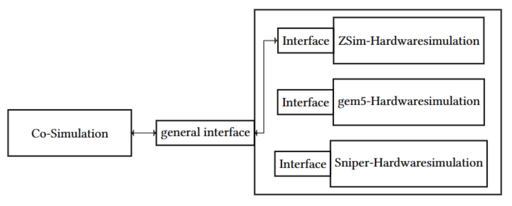
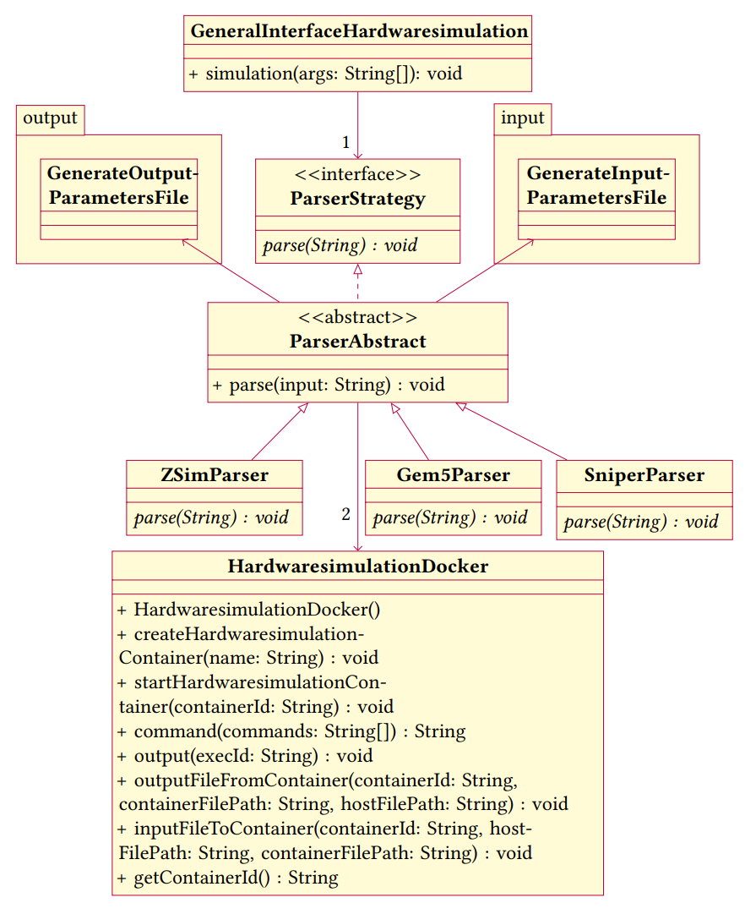

# generalInterfaceHardwaresimulation
 - A general interface is being developed to facilitate the exchange of hardware simulations within a specific class.
 - A hardware simulation is a simulation in which hardware components are virtually replicated to simulate their behavior, functionality, and performance. In this process, a software-based representation of the hardware is created, allowing the analysis, testing, or modeling of the behavior and interactions of real hardware.


## Figure: General Interface to Class of Hardware Simulations



The figure presents a high-level representation of a generic interface designed specifically for a class of hardware simulations. In the center of the figure, various hardware simulations such as [ZSim](https://github.com/dzhang50/zsim-plusplus), [gem5](https://github.com/gem5/gem5) and [Sniper](https://github.com/snipersim/snipersim). are depicted, which are supported by the interface.


## Figure: Structure of the Entire Software Design for the General Interface



The software design for the general interface encompasses a system of interacting classes that collaboratively fulfill the functionalities. The primary focal point is the `GeneralInterfaceHardwaresimulation` class, housing the crucial `simulation` method. The method takes a central role in choosing the appropriate "ParserStrategy" based on the provided `args` argument, which is args as options CommandLine , which has path to json input file. The chosen `ParserStrategy` invokes the `parse` method. The `ParserAbstract` abstract class forms the basis of this strategy, implementing the `parse` method. This abstraction gives rise to three specific implementations: `SniperParser`, `Gem5Parser`, and `ZSimParser`. Each derived class tailors the `parse` method to their unique requirements, reflective of the distinct configurations and operations inherent to each hardware simulation.

The `HardwaresimulationDocker` class offers an interface to execute hardware simulations within Docker containers. It encapsulates methods such as `createHardwareSimulationContainer` and `startHardwareSimulationContainer`, facilitating seamless interactions with the container environment.

Within the `input` and `output` packages, you will find the `GenerateInputParametersFile` and `GenerateOutputParametersFile` classes. These components are responsible for generating input and output parameter files, tightly integrated with their respective parser counterparts.


## Prerequisites: Installing Docker, Java, and Maven
To run this project, you need to have Docker, Java and Maven installed on your system. Follow the instructions below to install both components:


### Installing Docker
- [Docker](https://www.docker.com/get-started/) installieren


### Installing Java
1. Go to the official Java website: [https://www.oracle.com/java/technologies/downloads/#java17](https://www.oracle.com/java/technologies/downloads/#java17).
2. Download the 17th version of Java for your operating system.
3. Run the installation wizard and follow the instructions to install Java on your system.
4. Set the `JAVA_HOME` environment variable to the path of the `java-17-openjdk-amd64` directory.
5. Open a terminal or command prompt.
6. Enter the command `java -version` to verify the installed Java version. 

By setting the JAVA_HOME variable and checking the Java version, you can ensure that the installation of Java 17 was successful.

### Installing Maven
1. Go to the official Maven website: [https://maven.apache.org/download.cgi](https://maven.apache.org/download.cgi).
2. Download the latest version of Maven.
3. Extract the downloaded archive to a location of your choice.
4. Add the `bin` directory of the extracted Maven package to the `PATH` environment variable.
5. Verify the Maven installation by running the command `mvn -version` in a terminal or command prompt. You should see the installed Maven version displayed.


## Installing and Building General Interface for Hardware Simulation


### Installation general Interface Hardwaresimulation

```
git clone https://github.com/Mohammad-Nour-Dahi/generalInterfaceHardwaresimulation.git 
```

### Build the general interface
To build the program, please follow these steps:

1. Open a terminal or command prompt.
2. Navigate to the `GeneralInterfaceHardwaresimulation` directory.
3. Run the following command to install all the required dependencies and build the project:
```bash
mvn install
```


## Execution

### Creating an Input File
 
- To execute the program, you need to create an input file in JSON format that contains the input parameters for the execution. An example file can be found at resources as [HardwaresimulationParameter.json](HardwaresimulationParameter.json). You can use this file to run the generic interface.

### Running a C-Program in Hardware Simulation

- To execute the C-program in the hardware simulation, you may need to update the paths for the program and binary file. 
- You can run the example program by creating a file named `outputStats` in the root directory `D` and copying or moving the `program` directory from the `GeneralInterfaceHardwaresimulation` directory to the `outputStats` directory.
- you can select the value for `name` in the configuration file between "gem5", "sniper", and "zsim" to activate the corresponding hardware simulation.
- Configuration example for the hardware simulation:

```json
"hardwaresimulation": {
    "name": "gem5",   // Here you can choose between gem5, sniper, and zsim
    "programPath": "<Path_to_C_program>",
    "binaryPath": "<Path_to_binary_directory>",
...
}
```

- Replace `<Path_to_C_program>` with the valid path to the input source of the C-program, for example:

```json
"programPath": "D:/outputStats/program/fibonacci.c"
```

- Replace `<Path_to_binary_directory>` with the valid path to the directory where the compiled binary file of the program is stored, for example:

```json
"binaryPath": "D:/outputStats/program/fibonacci"
```

Please ensure that the specified directories and files exist and provide valid paths for the hardware simulation.


### Running the general interface

After running `mvn install`, a target file will be generated containing the executable program `GeneralInterfaceHardwaresimulation-1.0-SNAPSHOT-jar-with-dependencies.jar`. To execute the program, navigate to the `target` directory by running:

```bash
cd target
```

Then, enter the following command to start the program:

```bash
java -jar GeneralInterfaceHardwaresimulation-1.0-SNAPSHOT-jar-with-dependencies.jar -jsonFile <Path to the input.json>
```

Replace `<Path to the input.json>` with the actual file path of your JSON input file.

If you want to use the [HardwaresimulationParameter.json](HardwaresimulationParameter.json) file located at resources, you can execute the command as follows:

```bash 
java -jar GeneralInterfaceHardwaresimulation-1.0-SNAPSHOT-jar-with-dependencies.jar -jsonFile ../resources/HardwaresimulationParameter.json
```


 ## Output

After the execution, an `output.json` file will be generated. This file contains the simulation results.

The path to the output file is specified in the input file under the `statsOutputPath` parameter:

```json
{
  "commonParameters": {
    "hardwaresimulation": {
      "name": "gem5",
      ...
      "statsOutputPath": "D:/outputStats"
    },
     ...
  },
   ...
}
